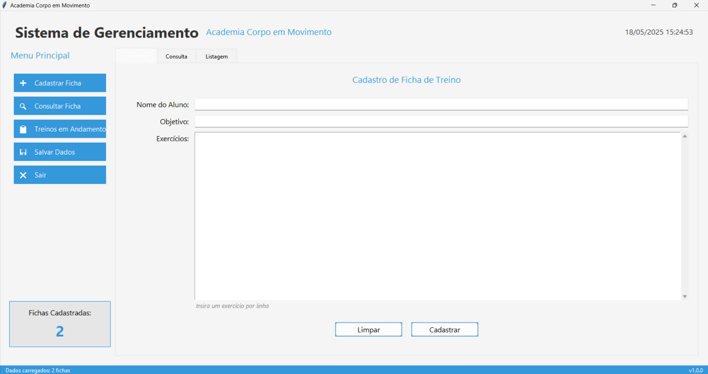

# Sistema de Gerenciamento de Fichas de Treino

Este projeto implementa uma aplicação desktop utilizando **Python** com **Tkinter**, focada na gestão de fichas de treino para uma academia fictícia chamada **Corpo em Movimento**.

O objetivo é atender às funcionalidades exigidas pela disciplina de Algoritmos e Programação, com ênfase na lógica dos fluxos principais, organização de dados e persistência em JSON.

---

## 🖼️ Imagem do Sistema



## ✅ Funcionalidades Atendidas

| Funcionalidade                              | Status |
| ------------------------------------------- | ------ |
| Cadastro de ficha de treino                 | OK     |
| Consulta de ficha pelo nome do aluno        | OK     |
| Listagem geral de fichas cadastradas        | OK     |
| Salvamento/Carregamento automático via JSON | OK     |
| Interface com menus, botões e abas          | OK     |
| Barra de status com contador de fichas      | OK     |
| Data e hora em tempo real                   | OK     |

---

## 🧠 Lógica de Funcionamento (com códigos)

### 1. Estrutura de Dados

As fichas de treino são armazenadas em uma **lista de dicionários**:

```python
self.fichas = []
```

Cada ficha é um dicionário com os seguintes dados:

```python
ficha = {
    "nome": nome,
    "idade": idade,
    "objetivo": objetivo,
    "exercicios": exercicios
}
```

As fichas são salvas e carregadas de um arquivo `.json`.

---

### 2. Cadastro de Ficha

Fluxo:

1. Usuário preenche campos.
2. Ao clicar em "Salvar", os dados são inseridos na lista `self.fichas`.
3. Os dados são salvos no arquivo `fichas.json`.

Código:

```python
def salvar_ficha():
    nome = nome_entry.get()
    idade = idade_entry.get()
    objetivo = objetivo_entry.get()
    exercicios = exercicios_entry.get()

    if nome and idade and objetivo and exercicios:
        ficha = {
            "nome": nome,
            "idade": idade,
            "objetivo": objetivo,
            "exercicios": exercicios
        }
        self.fichas.append(ficha)
        self.salvar_dados()
        self.atualizar_contador()
        ...
```

### 3. Consulta por Nome

Fluxo:

1. Usuário digita o nome.
2. O sistema percorre a lista `self.fichas` e retorna o primeiro nome correspondente.

Código:

```python
def consultar_ficha():
    nome = nome_entry.get()
    for ficha in self.fichas:
        if ficha["nome"].lower() == nome.lower():
            resultado_text.insert("1.0", ...)
            return
    resultado_text.insert("1.0", "Ficha não encontrada.")
```

### 4. Listagem Geral

Fluxo:

* O sistema percorre todas as fichas e exibe em uma área de texto.

Código:

```python
def mostrar_listagem(self):
    for ficha in self.fichas:
        texto.insert("end", f"Nome: {ficha['nome']}\n...")
```

### 5. Salvamento dos Dados

Fluxo:

* Sempre que uma ficha é adicionada ou a aplicação é fechada, os dados são salvos automaticamente em `fichas.json`.

Código:

```python
def salvar_dados(self):
    with open("fichas.json", "w") as f:
        json.dump(self.fichas, f, indent=4)
```

### 6. Carregamento Inicial

Fluxo:

* Ao iniciar a aplicação, verifica se o arquivo `fichas.json` existe. Caso sim, carrega os dados para `self.fichas`.

Código:

```python
def carregar_dados(self):
    if os.path.exists("fichas.json"):
        with open("fichas.json", "r") as f:
            self.fichas = json.load(f)
```

### 7. Encerramento Seguro

Fluxo:

* Ao fechar a janela, chama `self.sair()`, que salva os dados antes de sair.

Código:

```python
def sair(self):
    self.salvar_dados()
    self.root.destroy()
```

---

## 🎨 Parte Visual (Comentada de Forma Rasa)

* Utiliza `Tkinter` com `Canvas` e `ttk.Notebook` para organizar a interface.
* Botões laterais com ícones personalizados (via PIL).
* Cores e estilos definidos em variáveis globais.
* Cada aba é renderizada dinamicamente com `mostrar_cadastro`, `mostrar_consulta`, `mostrar_listagem`.
* Barra superior com data e hora atualizada a cada segundo (via `after`).
* Contador dinâmico é atualizado após cada cadastro.

---

## 📁 Dados Armazenados em JSON

Exemplo:

```json
[
  {
    "nome": "João da Silva",
    "idade": 30,
    "objetivo": "Emagrecimento",
    "exercicios": "Esteira, Bike, Abdominais"
  }
]
```

---

## 📅 Conclusão

O sistema está funcional, com lógicas simples e bem comentadas, ideais para alunos iniciantes em Python. A interface está organizada, responsiva e intuitiva. Todos os requisitos foram implementados com clareza e o código pode ser expandido facilmente para funcionalidades futuras.
